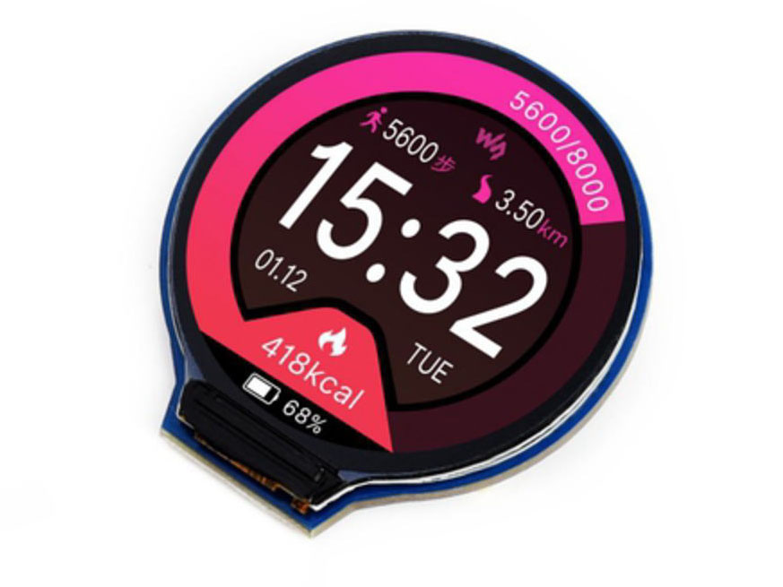
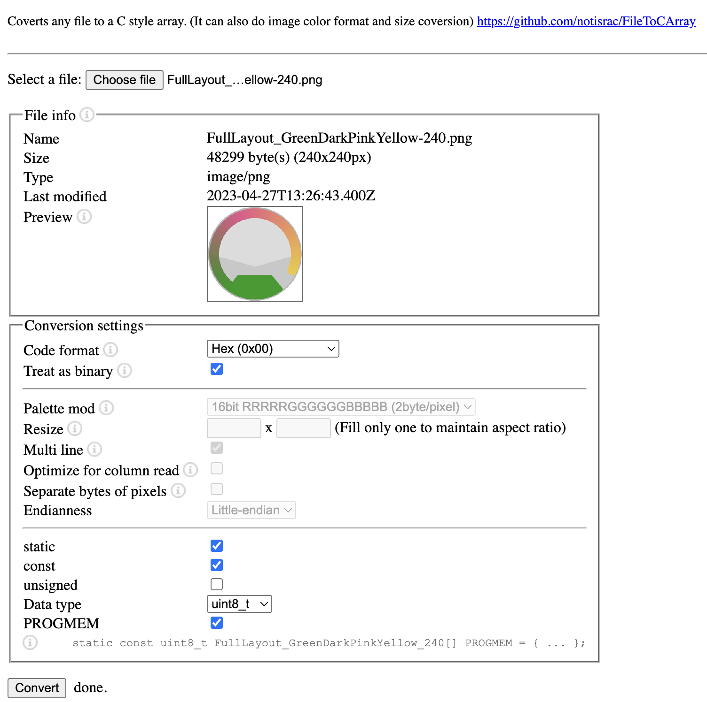

# RoundTFT
when i got the 1.28 inch TFT display they had really nice shots of guages, but there were now such exaples

I have now made a sSet of Assets, Resources and Code to use with a 1.28" or bigger Round TFT Displaies.

please use the following site to convert images then copy and paste the version into your header file.

https://notisrac.github.io/FileToCArray/

I have done my best be consitant with the colors, but if you wish a perticular colour schemm please add an iisue with the RGB hex values for each colour.
